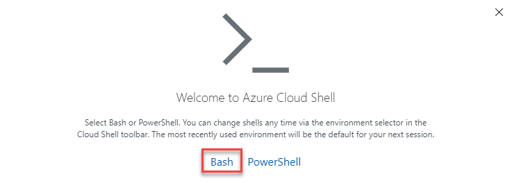
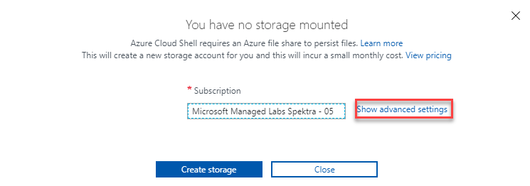
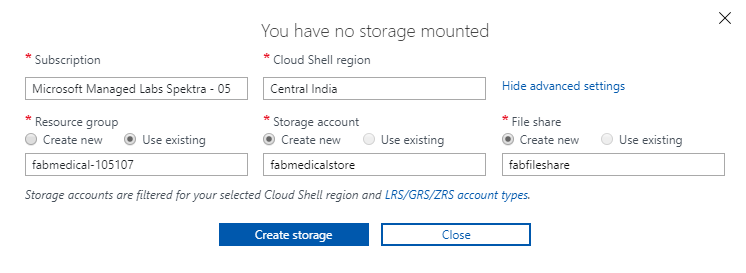

!["Microsoft Cloud Workshops"][logo]

<div class="MCWHeader1">
Cloud-native applications
</div>

<div class="MCWHeader2">
Before the hands-on lab setup guide
</div>

<div class="MCWHeader3">
October 2019
</div>

Information in this document, including URL and other Internet Web site references, is subject to change without notice. Unless otherwise noted, the example companies, organizations, products, domain names, e-mail addresses, logos, people, places, and events depicted herein are fictitious, and no association with any real company, organization, product, domain name, e-mail address, logo, person, place or event is intended or should be inferred. Complying with all applicable copyright laws is the responsibility of the user. Without limiting the rights under copyright, no part of this document may be reproduced, stored in or introduced into a retrieval system, or transmitted in any form or by any means (electronic, mechanical, photocopying, recording, or otherwise), or for any purpose, without the express written permission of Microsoft Corporation.

Microsoft may have patents, patent applications, trademarks, copyrights, or other intellectual property rights covering subject matter in this document. Except as expressly provided in any written license agreement from Microsoft, the furnishing of this document does not give you any license to these patents, trademarks, copyrights, or other intellectual property.

The names of manufacturers, products, or URLs are provided for informational purposes only and Microsoft makes no representations and warranties, either expressed, implied, or statutory, regarding these manufacturers or the use of the products with any Microsoft technologies. The inclusion of a manufacturer or product does not imply endorsement of Microsoft of the manufacturer or product. Links may be provided to third party sites. Such sites are not under the control of Microsoft and Microsoft is not responsible for the contents of any linked site or any link contained in a linked site, or any changes or updates to such sites. Microsoft is not responsible for webcasting or any other form of transmission received from any linked site. Microsoft is providing these links to you only as a convenience, and the inclusion of any link does not imply endorsement of Microsoft of the site or the products contained therein.

© 2019 Microsoft Corporation. All rights reserved.

**Contents**

<!-- TOC -->

- [Cloud-native applications before the hands-on lab setup guide](#cloud-native-applications-before-the-hands-on-lab-setup-guide)
  - [Requirements](#requirements)
  - [Before the hands-on lab](#before-the-hands-on-lab)
    - [Task 1: Setup Azure Cloud Shell](#task-1-setup-azure-cloud-shell)
    - [Task 2: Download Starter Files](#task-2-download-starter-files)
    - [Task 3: Setup Azure DevOps project](#task-3-setup-azure-devops-project)
    - [Task 4: Connect securely to the build agent](#task-4-connect-securely-to-the-build-agent)
    - [Task 5: Clone Repositories to the Build Agent](#task-5-clone-repositories-to-the-build-agent)

<!-- /TOC -->

# Cloud-native applications before the hands-on lab setup guide

## Requirements

1. Microsoft Azure subscription must be pay-as-you-go or MSDN.

   - Trial subscriptions will _not_ work.

   - To complete this lab setup (including [Task 5: Create a Service Principal](#Task-5-Create-a-Service-Principal)) ensure your account has the following roles:

     - The [Owner](https://docs.microsoft.com/en-us/azure/role-based-access-control/built-in-roles#owner) built-in role for the subscription you will use.
     - The [Application Administrator](https://docs.microsoft.com/en-us/azure/active-directory/users-groups-roles/directory-assign-admin-roles#application-administrator) built-in role for the Azure AD tenant you will use.
       - Check for the Application Administrator Role:
          - Login to the Azure Portal
          - Select Azure Active Directory
          - Select Users
          - Search for your user name and select
          - Select Directory role on your user profile page
          - You should see the list of currently assigned roles and "Application Administrator" should be in the list.

     > **Note** You may have to ask another subscription owner to login to the portal and execute that step ahead of time if you do not have the rights.

   - You must have enough cores available in your subscription to create the build agent and Azure Kubernetes Service cluster in [Task 6: Deploy ARM Template](#Task-6-Deploy-ARM-Template). You'll need eight cores if following the exact instructions in the lab, more if you choose additional agents or larger VM sizes. If you execute the steps required before the lab, you will be able to see if you need to request more cores in your sub.

2. An Azure DevOps account

3. Local machine or a virtual machine configured with:

   - A browser, preferably Chrome for consistency with the lab implementation tests.

4. You will be asked to install other tools throughout the exercises.

## Before the hands-on lab

**Duration**: 1 hour

You should follow all of the steps provided in this section _before_ taking part in the hands-on lab ahead of time as some of these steps take time.

### Task 1: Setup Azure Cloud Shell

1. Open cloud shell by selecting the cloud shell icon in the menu bar.

   

2. The cloud shell will open in the browser window Choose "Bash" if prompted.

   ![This is a screenshot of the cloud shell opened in a browser window. Bash was selected.]<kbd></kbd></br></br>

3. Click on **show advanced settings**.
     <kbd></kbd></br></br>

4. In **advanced settings** , select **Create new** for storage account and file share and fill the details 
     <kbd></kbd></br></br>

5. Bash will start working now 

   
### Task 2: Download Starter Files

In this task you will use `git` to copy the lab content to your cloud shell so that the lab starter files will be available.

> **Note**: If you don't have cloud shell available, refer back to Task 1: Setup Azure Cloud Shell.

1. Type the following command and press `<ENTER>`:

   ```bash
   git clone https://github.com/microsoft/MCW-Containers-and-DevOps.git
   ```

2. The lab files will download.

   

3. We do not need the `.git` folder and later steps will be
   less complex if we remove it. Run this command:

   ```bash
   rm -rf MCW-Containers-and-DevOps/.git
   ```


### Task 3: Setup Azure DevOps project

FabMedical has provided starter files for you. They have taken a copy of one of their websites, for their customer Contoso Neuro, and refactored it from a
single node.js site into a website with a content API that serves up the speakers and sessions. This is a starting point to validate the containerization of their websites. They have asked you to use this to help them complete a POC that validates the development workflow for running the website and API as Docker containers and managing them within the Azure Kubernetes Service environment.

1. Open a **new** Azure Cloud Shell console.
2. Navigate to FabMedical source code folder and list the contents.

   ```bash
   cd ~/MCW-Containers-and-DevOps/Hands-on\ lab/lab-files/developer/
   ll
   ```

   > **Important note**: If you will be taking the Infrastructure edition of the lab, instead of using the above instructions, type the following ones:
   >
   > ```bash
   > cd ~/MCW-Containers-and-DevOps/Hands-on\ lab/lab-files/infrastructure/
   > ll
   > ```
   >
   > This will take you to the version of the starter files that will be used by that edition of the lab.

3. You'll see the listing includes three folders, one for the web site, another
   for the content API and one to initialize API data:

   ```bash
   content-api/
   content-init/
   content-web/
   ```

4. Set your username and email which are used for git commits.

   ```bash
   git config --global user.email "you@example.com"
   git config --global user.name "Your Name"
   ```

5. Configure git CLI to cache your credentials, so that you don't have to keep
   re-typing them.

   ```bash
   git config --global credential.helper cache
   ```

6. Open a new browser tab to visit [Azure DevOps][devops] and log into your
   account.

   If this is your first time logging into this account you will be taken through a first-run experience:

   - Confirm your contact information and select next.
   - Select "Create new account".
   - Enter a fabmedical-SUFFIX for your account name and select Continue.

7. Create Azure DevOps Project.

   - Enter fabmedical as the project name.
   - Ensure the project is Private.
   - Choose the Advanced dropdown.
   - Ensure the Version control is set to Git.
   - Select the "Create Project" button.

   

8. Enable multi-stage pipelines:

   - Select your user icon in the top right corner.
   - Then choose the three dots to access the "Preview Features" menu item.
   - Toggle multi-stage pipelines to "On".

9. Next add an Azure Service Connection to your Azure DevOps account. Select the
   Project settings gear icon to access your settings. Then select Service Connections.

10. Choose "+ New service connection". Then pick "Azure Resource Manager" from
    the menu.

    

11. Select the link indicated in the screenshot below to access the advanced settings.


12. Enter the required information using the service principal information you
    created earlier.

    - **Connection name**: azurecloud
    - **Environment**: AzureCloud
    - **Subscription ID**: `id` from `az account show` output
    - **Subscription Name**: `name` from `az account show` output
    - **Service Principal Client ID**: `appId` from service principal output.
    - **Service Principal Key**: `password` from service principal output.
    - **Tenant ID**: `tenant` from service principal output.

    

13. Select "Verify connection" then select "OK".

    > **Note**: If the connection does not verify, then recheck and reenter the required data.

14. Next add another Azure Service Connection to your Azure DevOps account.
    Select the Project settings gear icon to access your settings. Then choose
    Service Connections.

15. Choose "+ New service connection". Then pick "Docker Registry" from
    the menu.

    

16. Enter the required information using the service principal information you
    created earlier.

    - **Environment**: Azure Container Registry

    - **Connection name**: Fabmedical ACR

    - **Azure Subscription**: Choose the subscription you are using for the lab

    - **Azure Container Registry**: Choose the registry created for you by the ARM deployment

    

17. Select "OK".

18. Next, choose "Repos" then use the repository dropdown to create a new
    repository by selecting "+ New repository".

    

    - Enter "content-web" as the repository name.

    - Once the project is created select "Generate Git credentials".

    

19. Copy the Personal Access Token and save it for later steps

19. Using your cloud shell window, initialize a new git repository for `content-web`.

    ```bash
    cd content-web
    git init
    git add .
    git commit -m "Initial Commit"
    ```

20. Return to your Azure DevOps tab and copy the commands to add your Azure DevOps repository as a new remote for
    push. Copy the commands for "**HTTPS**" similar to this example:

    ```bash
    git remote add origin https://fabmedical-sol@dev.azure.com/fabmedical-sol/fabmedical/_git/content-web
    git push -u origin --all
    ```

21. Now use the commands copied from Azure DevOps to configure the remote repository and push the code to Azure DevOps. When prompted for a password, paste your Azure DevOps Personal Access Token you copied earlier in this task.

22. Return to Azure DevOps and use the repository dropdown to create a second repository called `content-api`.

    > Note: You do not need to generate git credentials again. The same PAT will work for both repositories.

23. Using your cloud shell window, initialize a new git repository in the `content-api` directory.

    ```bash
    cd ../content-api
    git init
    git add .
    git commit -m "Initial Commit"
    ```

24. Copy the commands to add your `content-api` repository as a new remote for push. Copy the commands for "**HTTPS**".

25. Now use the commands copied from Azure DevOps to configure the remote repository and push the code to Azure DevOps. When prompted for a password, paste your Azure DevOps Personal Access Token you copied earlier in this task.

26. Use the repository drop down to create a third repository called
    `content-init`.

    > Note: You do not need to generate git credentials again. The same PAT will work for both repositories.

27. Using your cloud shell window, initialize a new git repository in the `content-init` directory.

    ```bash
    cd ../content-init
    git init
    git add .
    git commit -m "Initial Commit"
    ```

28. Copy the commands to add your `content-init` repository as a new remote for push. Copy the commands for "**HTTPS**".

29. Now use the commands copied from Azure DevOps to configure the remote repository and push the code to Azure DevOps. When prompted for a password, paste your Azure DevOps Personal Access Token you copied earlier in this task.

### Task 4: Connect securely to the build agent

In this section, you will validate that you can connect to the new build agent
VM.

1. From Azure cloud shell, run the following command to find the IP address for
   the build agent VM provisioned when you ran the ARM deployment:

   > **Note**: If you don't have cloud shell available, refer back to Task 1: Setup Azure Cloud Shell.

   ```bash
   az vm show -d -g fabmedical-[SUFFIX] -n fabmedical-[SHORT SUFFIX] --query publicIps -o tsv
   ```

   Example:

   ```bash
   az vm show -d -g fabmedical-sol -n fabmedical-SOL --query publicIps -o tsv
   ```

2. In the cloud shell output, take note of the public IP address for the VM.

   

3. Connect to the new VM you created by typing the following command:

   ```bash
    ssh -i [PRIVATEKEYNAME] [BUILDAGENTUSERNAME]@[BUILDAGENTIP]
   ```

   Replace the bracketed values in the command as follows:

   - [PRIVATEKEYNAME]: Use the private key name ".ssh/fabmedical," created above.

   - [BUILDAGENTUSERNAME]: Use the username for the VM, such as adminfabmedical.

   - [BUILDAGENTIP]: The IP address for the build agent VM, retrieved in the previous step

   ```bash
   ssh -i .ssh/fabmedical adminfabmedical@52.174.141.11
   ```

4. When asked to confirm if you want to connect, as the authenticity of the connection cannot be validated, type "yes".

5. When asked for the passphrase for the private key you created previously, enter this value.

6. You will connect to the VM with a command prompt such as the following. Keep this command prompt open for the next step:

   `adminfabmedical@fabmedical-SUFFIX:~$`

   

> **Note**: If you have issues connecting, you may have pasted the SSH public key incorrectly in the ARM template. Unfortunately, if this is the case, you will have to recreate the VM and try again.


### Task 5: Clone Repositories to the Build Agent

In this task you will clone your repositories from Azure DevOps so you can work
with them on the build agent.

1. As you previously did in cloud shell, set your username and email which are
   used for git commits.

   ```bash
   git config --global user.email "you@example.com"
   git config --global user.name "Your Name"
   ```

2. Configure git CLI to cache your credentials, so that you don't have to keep
   re-typing them.

   ```bash
   git config --global credential.helper cache
   ```

3. Visit the `content-web` repository in Azure DevOps and select "Clone" in the
   right corner.

   

4. Copy the repository url.

5. Use the repository url to clone the content-web code to your build agent machine.

   ```bash
   git clone <REPOSITORY_URL>
   ```

6. When prompted for password use your PAT token from previous steps.

7. In your browser, switch to the `content-api` repository and select "Clone" to see and copy the repository url.

8. Use the repository url and `git clone` to copy the content-api code to your build agent.

9. In your browser, switch to the `content-init` repository and select "Clone" to see and copy the repository url.

10. Use the repository url and `git clone` to copy the content-init code to your build agent.

> **Note**: Keep this cloud shell window open as your build agent SSH
> connection. The lab will instruct you to open additional cloudshell sessions
> as and when needed.

You should follow all steps provided _before_ performing the Hands-on lab.

[logo]: https://github.com/Microsoft/MCW-Template-Cloud-Workshop/raw/master/Media/ms-cloud-workshop.png
[devops]: https://dev.azure.com
